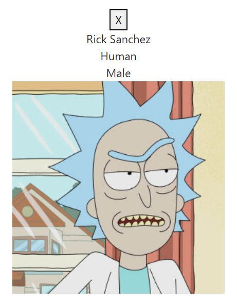
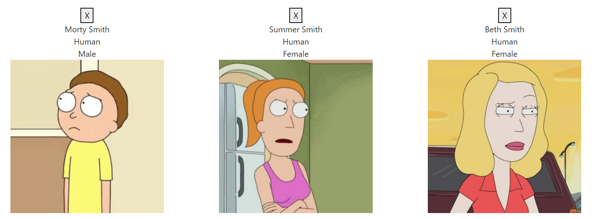
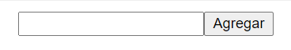
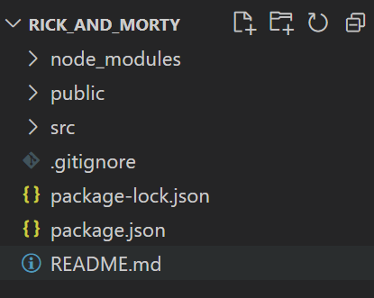
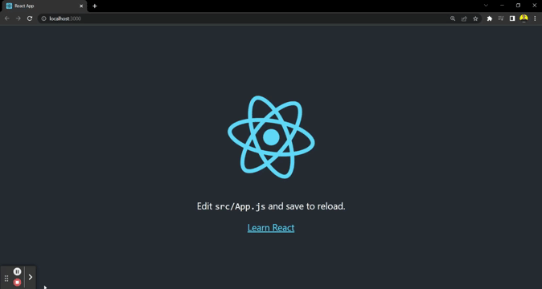
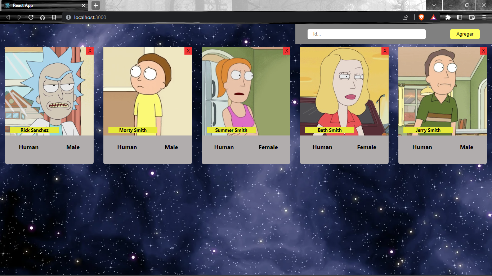
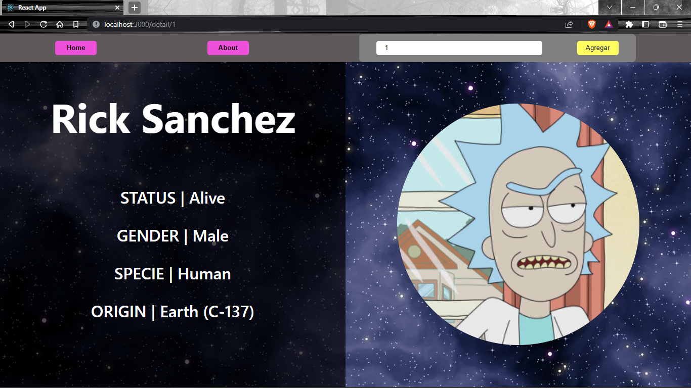

# **💪 HW6 | React Intro - Integration**

## **🕒 DURACIÓN ESTIMADA**

3 horas

</br >

---

<div align="center">

## **💻 RICK AND MORTY APP 💻**

</div>

## **📝 INTRO**

En esta homework vamos a crear nuestro proyecto de **Rick and Morty**. Comenzaremos construyendo nuestros primeros componentes: **card**, **cards** y **searchBar**.

> [**Nota**]: todos los componentes que hagamos en esta homework son **`puros`**, por lo tanto, ninguno tiene estado, simplemente reciben datos por props. No te preocupes por el estilo de los componentes, en la siguiente homework vamos a dárselos.

</br >

---

## **📋 INSTRUCCIONES**

## **🚀 PARTE UNO 🚀**

<br />

### **👩‍💻 EJERCICIO 1**

Tu primer paso será ejecutar el comando **`npm install`** para instalar todas las dependencias dentro de esta homework.

En el archivo **`App.js`** ya hay importado 3 componentes: **Card**, **Cards** y **SearchBar**. Estos componentes reciben propiedades y están siendo renderizados en nuestra aplicación.

<br />

---

### **👩‍💻 EJERCICIO 2 | Card**

Dirígete al componente **`Card`** y renderiza las siguientes propiedades de los personajes:

-  **name**: nombre.
-  **status**: status.
-  **species**: especie.
-  **gender**: género.
-  **origin**: origen (ten en cuenta que el nombre del origen viene dentro de otra propiedad llamada **`name`**).
-  **image**: imagen.

Además, cuando el usuario haga click en la **X** de "cerrar", debe ejecutarse una función que también viene como props llamada **onClose**.

> [**NOTA**]: por el momento, toda la información de los personajes la vamos a obtener a partir del archivo [**`data.js`**](./src//data.js)



<br />

---

### **👩‍💻 EJERCICIO 3 | Cards**

Utilizaremos este componente para renderizar muchos componentes **`Card`**. En otras palabras, este componente será el "_contenedor_" de todas las Cards.

Lo primero que debes hacer es recibir la propiedad **`characters`** mediante las props. Esta propiedad es una arreglo con todos tus personajes. Por cada uno de ellos deberás renderizar un componente **`Card`** pasándole todas las propiedades que ya mencionamos en el ejercicio anterior.

> [**NOTA**]: agrega una propiedad llamada **`key`** y que sea igual al ID del personaje.

> [**NOTA**]: puedes guiarte con la [**`documentación de React`**](https://es.reactjs.org/docs/lists-and-keys.html#rendering-multiple-components) para realizar este ejercicio.



<br />

---

### **👩‍💻 EJERCICIO 4 | SearchBar**

Este componente nos permitirá buscar y agregar nuevos personajes a nuestra aplicación.

Recibe por props una función **`onSearch`**. La función **`onSearch`** se debe ejecutar cuando se haga click en el botón **`Agregar`**.



<br />

---

## **🚀 PARTE DOS 🚀**

<br />

### **¡Listo! Es hora de crear nuestra app...**

¿Ya completaste los puntos anteriores y todo funciona? ¡Perfecto! Ya podemos comenzar a crear nuestra propia app:

1. Dirígete a un nuevo directorio desde tu terminal (por ejemplo, tu escritorio). Allí es dónde crearás tu aplicación.

2. Ahora utiliza **_`CRA`_** (create-react-app) mediante **npx** para crear una nueva app de React:

```bash
npx create-react-app rick_and_morty
```

> [**NOTA**]: para el nombre de tu app no puedes usar mayúsculas ni el símbolo "&".

Al término del proceso, podrás ver que en tu directorio se creó una nueva carpeta llamada "rick_and_morty". Abre esta carpeta con tu Visual Studio Code. Allí encontrarás algo como esto:



3. Dentro de esta nueva carpeta ejecuta:

```bash
    npm start
```

> [**NOTA**]: si aún tenemos corriendo el server local de la homework Integration Parte 1, vamos a obtener un error debido a que el puerto predeterminado (3000) está ocupado. Podemos elegir utilizar otro puerto, o terminar el proceso anterior y luego reintentarlo.

Esperamos que se "levante" el servidor local y luego veremos algo así:



<br />

---

Ahora simplemente debes seguir estos pasos:

1. Reemplaza la carpeta **`src`** de tu nuevo proyecto por la que tienes en esta carpeta ([**src**](./src/)).

2. Comprueba que en el navegador deberías ver los cambios.


# **💪 HW7 | React Estilos - Integration**

## **🕒 DURACIÓN ESTIMADA**

Dependerá de todo el amor que le quieras colocar a tu app 💛

<br />

---

<div align="center">

## **💻 RICK AND MORTY APP 💻**

</div>

## **📝 INTRO**

A partir de ahora todas las homeworks integradoras se trabajarán directamente en la aplicación que creaste en la homework anterior.

En esta homework podrás escoger entre cualquiera de los tipos de estilos que hemos aprendido en la lecture para aplicarlos en tu aplicación:

-  **Legacy**
-  **Inline Styling**
-  **CSS Module**
-  **Styled Components**

> [**NOTA**]: en caso de utilizar **`Styled Components`** deberás instalar dicha dependencia desde la carpeta raíz de tu proyecto de **_Rick & Morty:_**

```bash
    npm install styled-components
```

<br />

---

## **📋 INSTRUCCIONES**

### **👩‍💻 EJERCICIO 1**

¡Tu tarea consiste en agregar estilos CSS para que los componentes **Card**, **Cards** y **SearchBar** se vean increibles!

No hay consignas que debas seguir, puedes darle tu toque personal. **Sé creativ@!** 🧑‍🎨

Puedes guiarte con esta imagen:



# **💪 HW9 | React Routing - Integration**

## **🕒 DURACIÓN ESTIMADA**

90 minutos

<br />

---

<div align="center">

## **💻 RICK AND MORTY APP 💻**

</div>

## **📝 INTRO**

En esta homework integraremos **React Router DOM** para enrutar las distintas vistas de nuestra aplicación. Esto quiere decir que podremos decidir en que path o "link" se renderice cada componente.

<br />

---

## **📋 INSTRUCCIONES**

### **👩‍💻 EJERCICIO 1 | Instalación y configuración**

1. Instala **`react-router-dom`** desde la terminal.
2. Una vez hecho esto, dirígete al archivo **`index.js`** e importa y envuelve toda tu aplicación con "**BrowserRouter**".
3. Importa los componentes "**Routes**" y "**Route**" de _react-router-dom_ en tu archivo **`App.js`**.

<br />

---

### **👩‍💻 EJERCICIO 2 | About**

Ahora crearemos un componente para presentar nuestro perfil. Crea un componente llamado **`About`**. Este componente será una vista que contenga tu información.

Esto es completamente libre. Puedes mostrar incluso una imagen tuya. Esto le servirá a las personas que vean tu App para conocer al creador 🚀✨.

Una vez construido el componente:

1. Dirígete al componente **`Nav`** e importa la etiqueta **Link**.
2. Crea dos botones. Uno con el texto "**About**" y que te redirija a **`/about`**, y otro con el texto "**Home**" que te redirija a **`/home`**.

> [**NOTA**]: podrías utilizar NavLink para darle estilos al link About y Home.

<br />

---

### **👩‍💻 EJERCICIO 3 | Routing**

Comenzaremos creando un componete llamador **Deatil** el cual solo mostrara una etiqueda **`div`** vacía.

Luego, dirígete al archivo **`App.js`**. Ahora crearemos las rutas de los componentes. Cada componente debe renderizarse en las siguientes rutas:

-  **Nav** debe que aparecer en todas las rutas.
-  **Cards** debe aparecer solo en la ruta **`/home`**.
-  **About** debe aparecer solo en la ruta **`/about`**.
-  **Detail** debe aparecer solo en la ruta **`/detail/:id`**.

> [**NOTA**]: ten en cuenta que la ruta del componente **Detail** recibe un parámetro **`id`**.

Comprueba en tu navegador que cada componente se renderice en la ruta indicada. Debería quedarte de esta manera:


<br />

---

### **👩‍💻 EJERCICIO 4 | Detail redirection**

En este ejercicio te encargarás de crear la redirección hacia el _detail_ de un personaje. Para esto:

1. Dirígete al componente **`Card`** e importa la etiqueta **Link**.
2. Envuelve el nombre del personaje en esta etiqueta, y que redirija a la ruta **`/detail/:id`**.

> [**NOTA**]: debes pasarle como parámetro el **id** del personaje. personaje para usarlo en el Link.

```js
// Card.js
...
<Link to={`/detail/${id}`} >
  <h3 className="card-name">{name}</h3>
</Link>
...
```

En este momento, cuando hacemos click sobre el nombre de un personaje nos debe redirección a la ruta especificada.


<br />

---

### **👩‍💻 EJERCICIO 5 | Detail**

¡Genial! Las funcionalidades ya están. Ahora es momento de contruir nuestro componente **`Detail`**. Para esto dirígete a este componente y:

1. Importa axios.
2. Importa el hook **useParams** y obten el **id** del personaje.
3. Importa el hook **useState** y crea un estado local con el nombre "**_character_**" que se inicialice como un objeto vacío.
4. En este paso importaremos el hook **useEffect** de **`react`**. Una vez importado, copia el siguiente código y pégalo en el cuerpo del componente.

```js
useEffect(() => {
   axios(`https://rickandmortyapi.com/api/character/${id}`).then(({ data }) => {
      if (data.name) {
         setCharacter(data);
      } else {
         window.alert('No hay personajes con ese ID');
      }
   });
   return setCharacter({});
}, [id]);
```

> [**NOTA**]: este código es el que buscará al personaje de la API cada vez que el componente se monte. Y luego, cada vez que se desmonte, borrará su información.

<br />

---

### **👩‍💻 EJERCICIO 6 | Detail rendering**

Ahora en el estado local **character** ya tenemos disponible toda la información que necesitamos de nuestro personaje. Por lo que:

1. Renderiza **condicionalmente** cada una de estas propiedades.

-  **name**
-  **status**
-  **species**
-  **gender**
-  **origin** (ten en cuenta que el nombre se guarda dentro de otra propiedad "_name_")
-  **image**

Debería quedarte algo como esto:



<br />

> [**NOTA**]: como la información del personaje de obtiene a partir de una petición asincrónica a la API de Rick & Morty, puede que la información aún no esté disponible cuando la quieras renderizar. ¡Aquí es donde debes aplicar renderizado condicional! Te dejamos la [**documentación**](https://reactjs.org/docs/conditional-rendering.html#:~:text=Conditional%20rendering%20in%20React%20works,the%20UI%20to%20match%20them.&text=This%20example%20renders%20a%20different,the%20value%20of%20isLoggedIn%20prop.) como ejemplo.

<br />

---

### **📌 EXTRA CREDIT**

Ahora te desafiamos a que crees un nuevo componente llamado **Error**. A este componente le podrás dar los estilos que quieras, pero la idea es que se muestre un mensaje de error 404. ¡Puedes inspirarte en este [**ejemplo**](https://github.com/errroorrxd)!

El desafío es el siguiente: haz que este componente se muestre cada vez que el usuario ingrese a cualquier otra ruta que no exista. Es decir que no la hayas especificado en esta homework. Por ejemplo, si creaste una ruta "`/home`" y "`/about`", y el usuario en el navegador escribe y "`/henry`", debería mostrar el componente Error 404.
